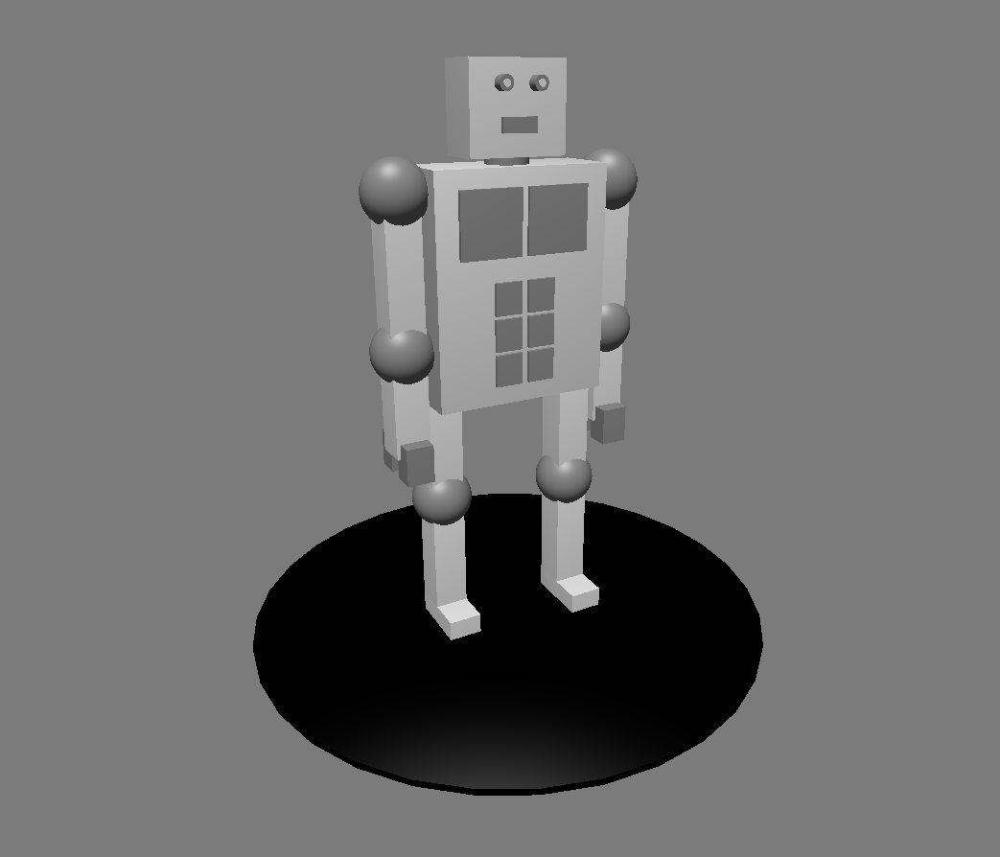
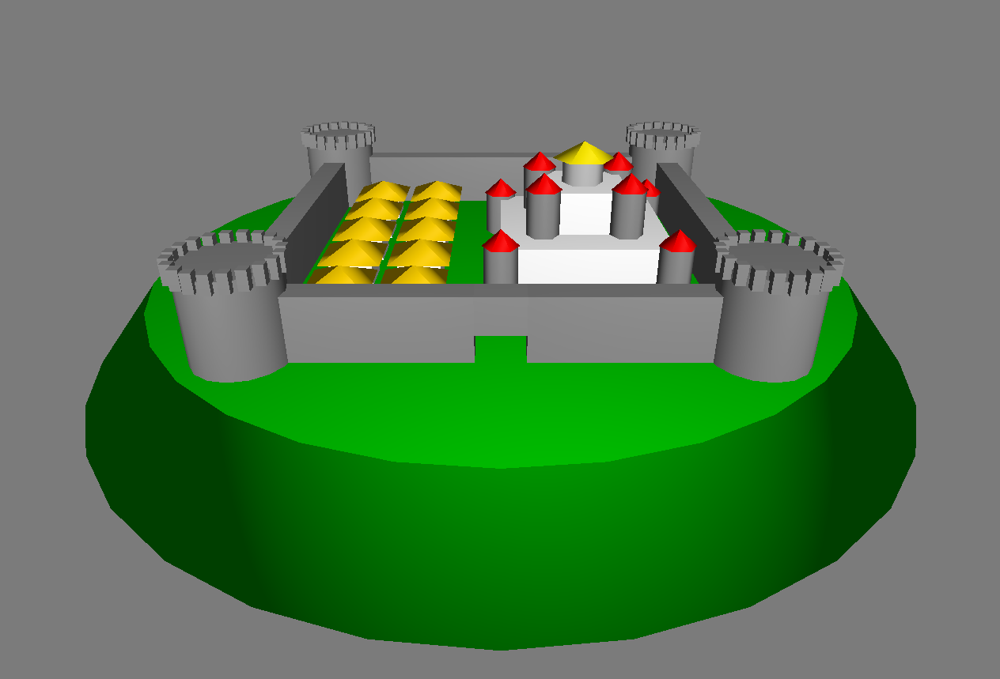
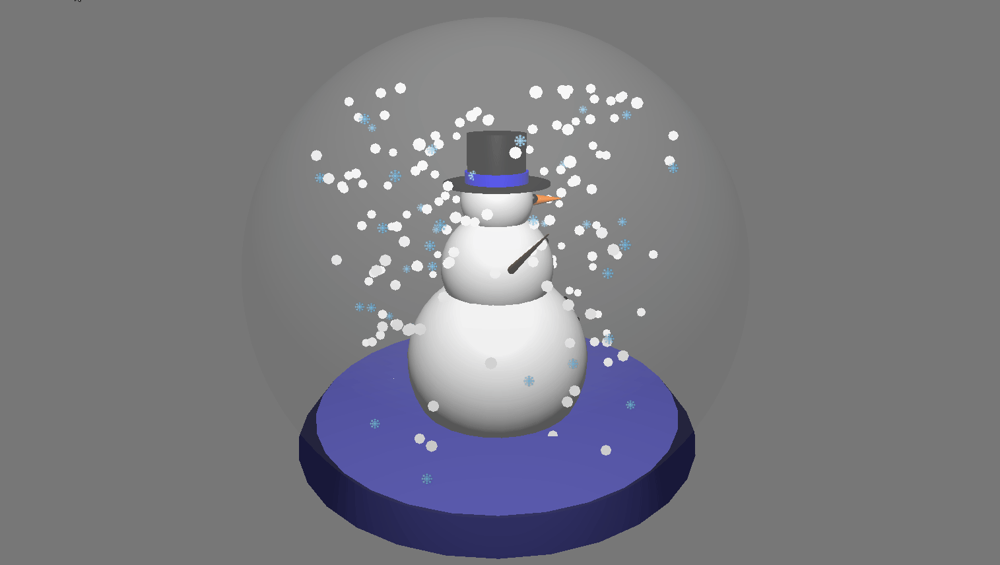
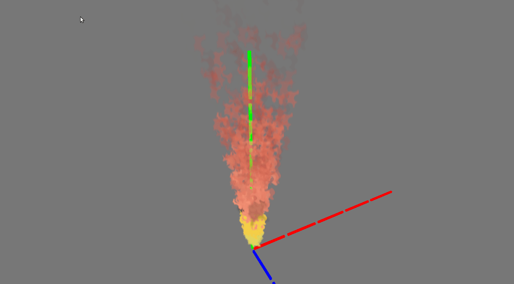

# Arara Game Engine

A game engine written in Rust, based in [glium](https://github.com/glium/glium), [glam](https://github.com/bitshifter/glam-rs) and [bevy-ecs](https://github.com/bevyengine/bevy).

### Examples

The code of this examples can be found at the [examples](./examples) folder, and the screenshots and videos are at [docs](./docs) folder.

* **Snowman Exemple**
    ```shell
    cargo run --example snow-man
    ```
    <details>
        <summary>Snowman ScreenShot</summary>
        
    </details>

* **Robot Example**
    ```shell
    cargo run --example robot
    ```
    <details>
        <summary>Robot ScreenShot</summary>
        
    </details>

* **Castle Example**
    ```shell
    cargo run --example robot
    ```
    <details>
        <summary>Castle ScreenShot</summary>
        
    </details>

#### Examples with particles:

* **Snowman Exemple**
    ```shell
    cargo run --example snow-man
    ```
    <details>
        <summary>Snowman GIF</summary>
        
    </details>

* **Fire**
    ```shell
    cargo run --example fire
    ```
    <details>
        <summary>Fire GIF</summary>
        
    </details>
